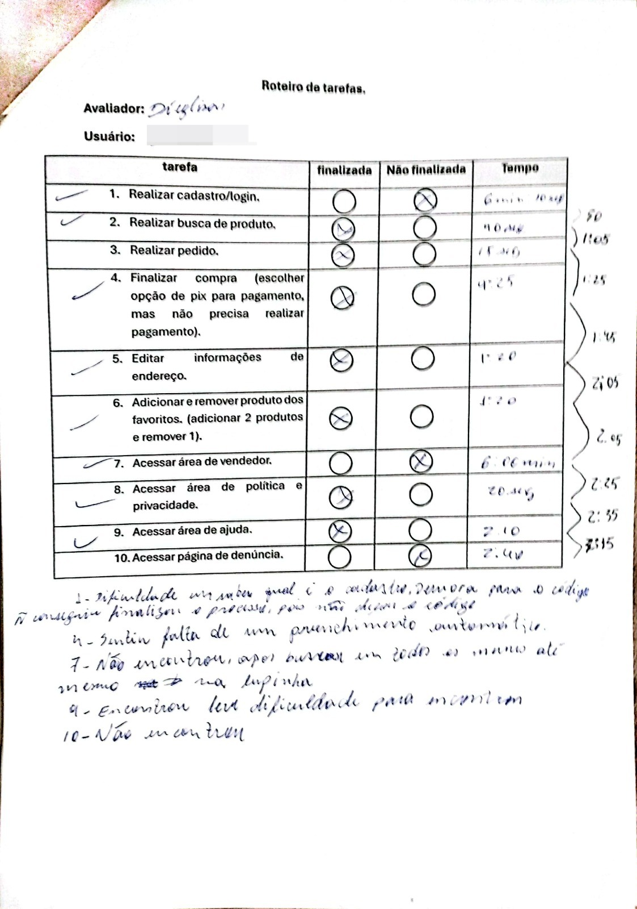
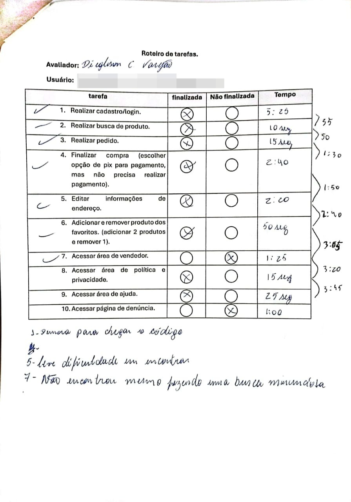
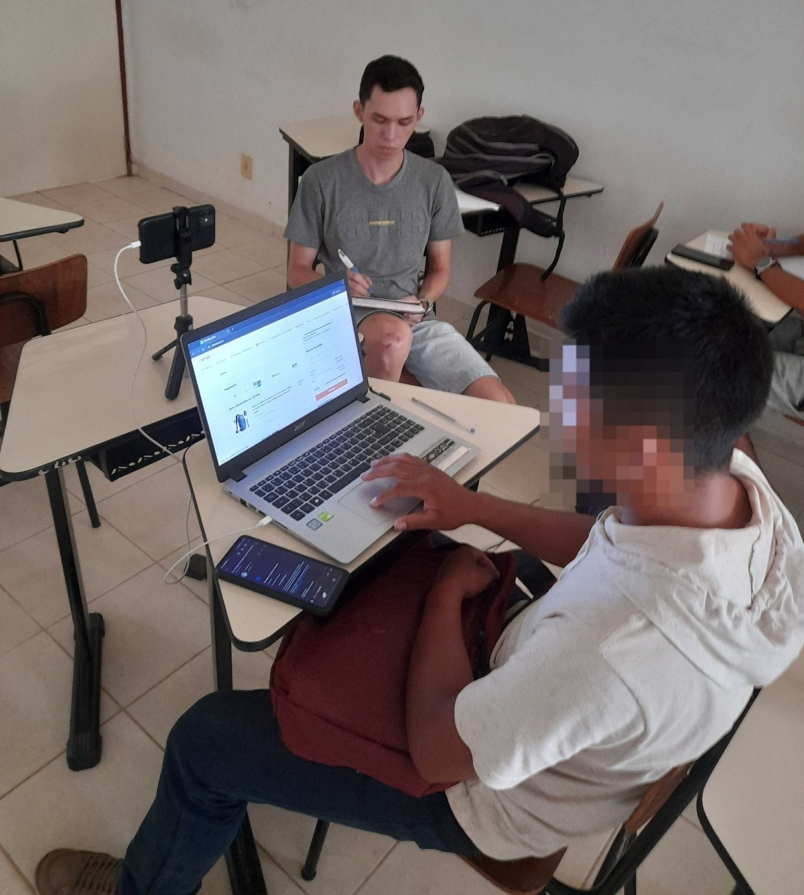
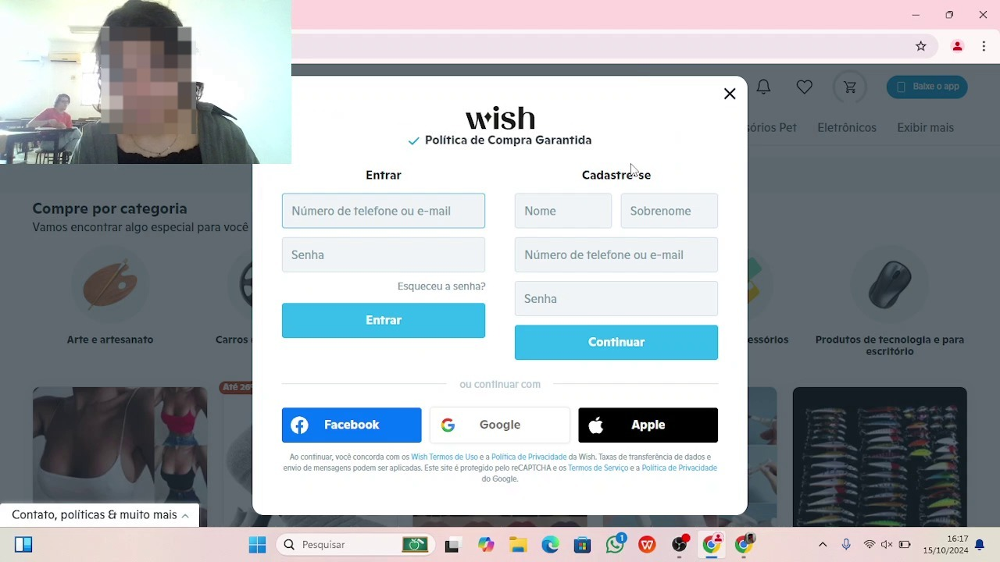

## - [Home](/README.md)
# 6 – Método de Avaliação de Comunicabilidade (MAC)

### 6.1 Planejamento

O Método de Avaliação de Comunicabilidade (MAC) é uma técnica que visa monitorar a interação dos usuários com um sistema em um ambiente controlado. Seu principal objetivo é avaliar a qualidade da comunicação entre o designer e o usuário.

O processo do MAC inclui:

- Preparação da avaliação
- Gravação da interação do usuário com o sistema
- Etiquetagem do vídeo de interação
- Tabulação e interpretação dos dados

Para iniciar a avaliação, foi planejado o seguinte:

- Escolha do ambiente: uma sala vazia na universidade
- Criação do cenário:
  - Quatro notebooks com acesso à internet
  - Navegador Chrome para acessar o site
  - Caneta e papel com as tarefas
  - Cronômetro para marcar o tempo de execução
  - Gravador de tela para confirmação no relatório

Os participantes voluntários foram informados sobre o processo e assinaram um Termo de Consentimento Livre e Esclarecido.

<figure align="center">
  <figcaption>Figura 1. TCL - Avalaicao MAC</figcaption>
  
  <figcaption><i>Fonte: Autoria própria</i></figcaption>
</figure>

  <a href="TCLE/tcl_1.md" style="display: inline-block; margin: 10px 20px; text-decoration: none; color: inherit;">TCL 1</a>

--- 

### 6.2 Roteiro das Atividades

Os usuários deveriam realizar as seguintes atividades:

1. Realizar cadastro/login
2. Realizar busca de produtos
3. Realizar pedido
4. Finalizar compra (escolher opção de PIX para pagamento, sem realizar o pagamento)
5. Editar informações de endereço
6. Adicionar e remover produtos dos favoritos (adicionar 2, remover 1)
7. Acessar área de vendedor
8. Acessar a área de política e privacidade
9. Acessar a área de ajuda
10. Acessar a página de denúncia

As atividades poderiam ser classificadas como "Finalizada" ou "Não finalizada".

<figure align="center">
  

    

      <figcaption>Figura 1. Roteiro 1</figcaption>
      
      <figcaption><i>Fonte: Autoria própria</i></figcaption>
    

     
     
    

      <figcaption>Figura 2. Roteiro 2</figcaption>
      
      <figcaption><i>Fonte: Autoria própria</i></figcaption>
    

  

</figure>

--- 

### 6.3 Perfis dos Usuários

O público-alvo para este teste foi definido com os seguintes critérios:

- Usuários: Consumidores de produtos e-commerce
- Número de participantes: 4 usuários
- Faixa etária: entre 18 e 23 anos
- Profissão: Sem restrição
- Escolaridade: alfabetizados
- Classe econômica: Sem restrição
- Requisitos: Já ter utilizado um computador

--- 

### 6.4 Execução

O processo de execução seguiu as seguintes etapas:

1. Os voluntários foram direcionados para a sala preparada
2. Assinatura do termo de consentimento
3. Orientação sobre o roteiro das atividades
4. Início do teste, gravação da tela e cronometragem
5. Esclarecimento sobre a possibilidade de desistência
6. Anotações do instrutor sobre a conclusão das tarefas e tempo de execução

<figure align="center">
  

    

      <figcaption>Figura 1. Teste de Comunicabilidade</figcaption>
      
      <figcaption><i>Fonte: Autoria própria</i></figcaption>
    

     
     
    

      <figcaption>Figura 2. Teste de Comunicabilidade</figcaption>
      
      <figcaption><i>Fonte: Autoria própria</i></figcaption>
    

  

</figure>

--- 

### 6.5 Resultados

#### Tabela: Resultado da avaliação dos usuários (Tarefa 1)

| Participante | Resultado |
|--------------|-----------|
| P1 | Conseguiu |
| P2 | Conseguiu com um pouco de dificuldade |
| P3 | Conseguiu com bastante dificuldade |
| P4 | Conseguiu com bastante dificuldade |

#### Quantidade de Etiquetas

| Etiqueta | Quantidade |
|----------|------------|
| Cadê? | 6 |
| E agora? | 2 |
| O que é isto? | 0 |
| Epa! | 3 |
| Onde estou? | 0 |
| Assim não dá. | 3 |
| Por que não funciona? | 2 |
| Ué, o que houve? | 2 |
| Pra mim está bom... | 1 |
| Desisto! | 9 |
| Vai de outro jeito. | 0 |
| Não! Obrigado. | 3 |
| Socorro! | 4 |

