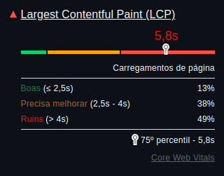
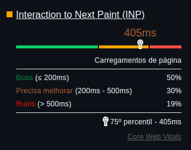
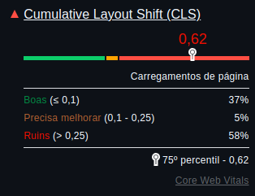
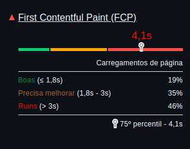
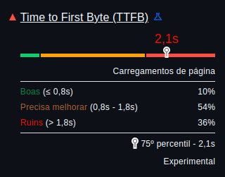
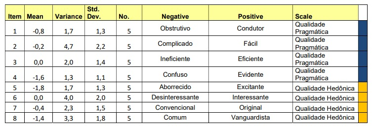
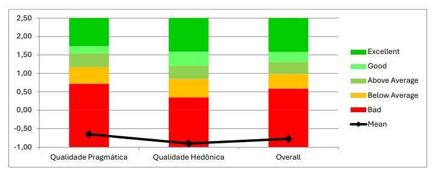
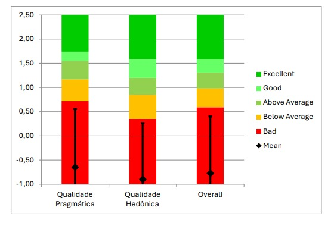

## - [Home](/README.md)
# 5 – Avaliação UX

### 5.1 Planejamento

Foram selecionadas duas ferramentas para a análise de UX do site UEQ.org, O "PageSpeed Insights" e o "LightHouse Report", com o propósito de analisar os problemas de acessibilidade da plataforma e reunir feedbacks sobre a mesma, e logo depois realizar uma relação entre esses feedbacks e a análise de acessibilidade.

### 5.2 Ferramenta PageSpeed Insights e o LightHouse Report
A plataforma "LightHouse Report" é uma ferramenta que analisa uma plataforma proposta pelo usuário e identifica a maioria dos problemas de acessibilidade em relação à experiência do usuário. Já a plataforma "PageSpeed Insights" informa uma descrição mais detalhada dos problemas de acessibilidade, descrevendo-os de maneira simples e direta. 

Os teste foram realizados após teste de usabilidade/feedbacks dos participantes, a área escolhida foi a tela inicial do sistema, onde ocorreram os check-ups da ferramenta em relação ao sistema.

### 1° Etapa

**LCP**: Se baseia em quanto tempo leva para o conteúdo principal da página ser mostrado para o usuário, precisando ser menor que 2,5 segundos para ser eficiente, com isso em mente, os resultados de LCP do teste da UEQ.org foram:

---

**INP**: Se trata do tempo de resposta do sistema em correspondência com a interação do usuário(cliques, toques, etc.) tendo que ser menor que 200ms, com isso em mente, os resultados de INP do teste da UEQ.org foram:

---

**CLS**: Informação sobre o quanto os elementos se movem durante o uso do sistema, precisando ser menor que 0,1 para não gerar problemas ao usuário, com isso em mente, os resultados de CLS do teste da UEQ.org foram:

---

**FCP**: Informação que indica quanto tempo demora para o sistema demora para mostrar conteúdo ao usuário, sendo necessário que esse tempo seja menor que 1,8 para ser eficiente, com isso em mente, os resultados de FCP do teste da UEQ.org foram:

---

**TTFB**: Se trata de quanto tempo o servidor demora para entrar em contato com o navegador/enviar dados a ele, esse tempo deve ser menor que 0,8 segundos para que não cause problemas, com isso em mente, os resultados de TTFB do teste da UEQ.org foram:

---

#### Tabela: Descrição LightHouse

| FERRAMENTA UTILIZADA | MÉTRICAS | DESCRIÇÃO | FEEDBACK |
|----------------------|----------|-----------|----------|
| LightHouse Report | LCP | Ocorre um atraso constante nos carregamentos da página | Usuários reportaram que não conseguem identificar com facilidade se a plataforma está inicialmente funcionando corretamente |
| PageSpeed Insight | INP | O sistema apresenta um atraso notável na hora de responder com as interações do usuário | Usuários reportaram que o atraso frequente de resposta do sistema deixa todas as atividades consideravelmente mais demoradas |
| LightHouse Report | CLS | Os elementos são estáticos e não apresentam nenhum erro notável | Usuários não reportaram nenhuma informação sobre essa métrica |
| LightHouse Report | FCP | O tempo de resposta inicial da plataforma pode ser mais lento que o esperado, mas é o suficiente para o usuário saber que o sistema ainda está funcionando | Usuários reportaram que ainda é possível identificar que o site está funcionando, apesar de estar trabalhando de forma lenta |
| LightHouse Report | TTFB | A conexão com o navegador é lenta demais, causando problemas como atraso no envio de emails e respostas | Ocorreram reclamações frequentes de faltas de resposta do sistema, como emails e códigos que demoram quase 30 minutos para serem entregues |

### 2° Etapa

**Results:** "Valores entre -0,8 e 0,8 indicam uma avaliação neutra de cada escala, os valores > 0,8 indicam uma boa avaliação e valores < -0,8 indicam uma classificação ruim. A escala varia entre -3 (muito ruim) e +3 (muito bom) para avaliar pessoas com opiniões e atitudes diferentes. Evite áreas de resposta crítica para ver valores acima de +2 ou abaixo de -2. Portanto, apesar do valor ideal de +1,5 para a escala, do ponto de vista puramente visual, numa escala de -3 a +3, não parece bom."

**Benchmark:** "Referência: Este conjunto de dados contém dados de 21.175 pessoas de 468 estudos relativos a diferentes produtos (software empresarial, páginas web, lojas online, redes sociais)."

  <figcaption>Figura 1. Results</figcaption>
  
  <figcaption>
    <a href="https://www.ueq-online.org/" target="_blank">Referência: UEQ.org</a>
  </figcaption>

  <figcaption>Figura 2. Benchmark 1</figcaption>
  
  <figcaption>
    <a href="https://www.ueq-online.org/" target="_blank">Referência: UEQ.org</a>
  </figcaption>

  <figcaption>Figura 3. Benchmark 2</figcaption>
  
  <figcaption>
    <a href="https://www.ueq-online.org/" target="_blank">Referência: UEQ.org</a>
  </figcaption>

## - [Home](/README.md)
