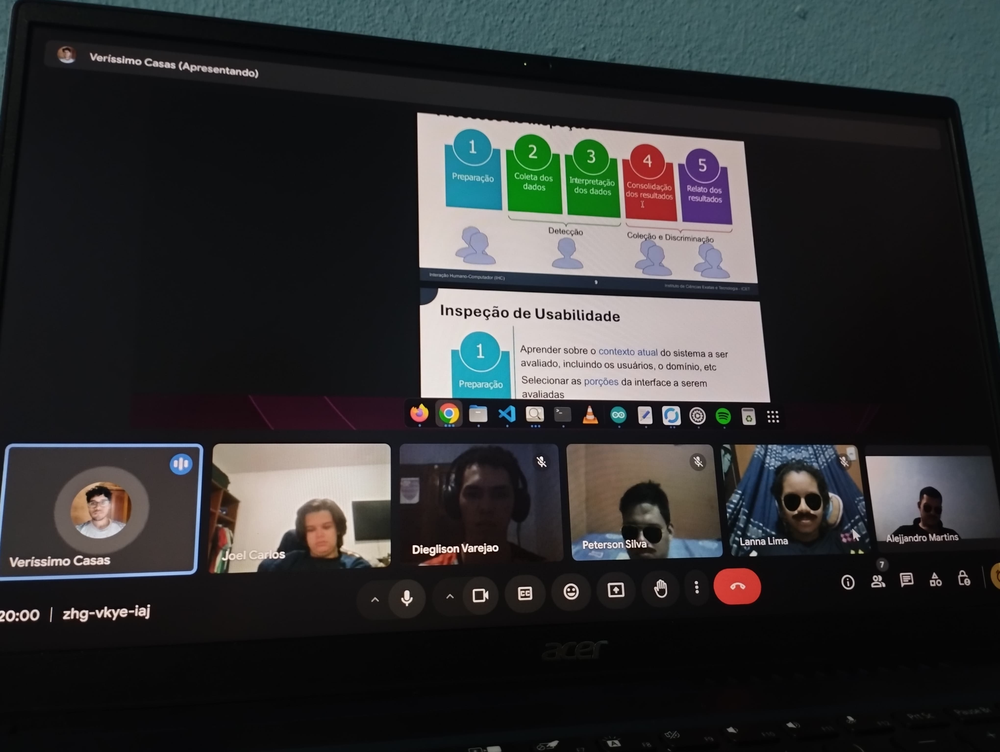

## - [Home](/README.md)
# 3 - Inspeção de Usabilidade
### 3.1 - Planejamento
- Para inspeção de usabilidade, planejamos entender melhor a funcionalidade do quadro Wish. Foi feita uma análise da funcionalidade do site e de todo o conteúdo oferecido aos usuários. Fizemos uma avaliação detalhada do site da Wish para determinar quais eram mais relevantes para o nosso projeto. Classificamos as telas como “telas gerais” que não requerem login e são acessíveis a todos os visitantes do site. e as “telas específicas” são específicas para cada tipo de usuário (comprador e vendedor) e para cada tela selecionada atribuímos uma pontuação de 0 a 5, onde 0 indica que  a tela é irrelevante e com pontuação 5 é uma tela muito importante para o fluxo de navegação do usuário. Em seguida, coletamos todas as avaliações individuais e analisamos os resultados para descobrir quais delas eram mais relevantes e seriam priorizadas em nosso trabalho, e oito telas foram selecionadas.

<figure align="center">
  <figcaption>Figura 1. Meet de Planejamento</figcaption>
  
  <figcaption><i>Fonte: Autoria própria</i></figcaption>
</figure>

### 3.2 [Detecção](/docs/inspecao_usabilidade/tabela_deteccao.md)
### 3.3 [Coleção](/docs/inspecao_usabilidade/tabela_colecao.md)
### 3.4 [Discriminação](/docs/inspecao_usabilidade/tabela_discriminacao.md)
### 3.5 [Consolidação](/docs/inspecao_usabilidade/tabela_consolidacao.md)
