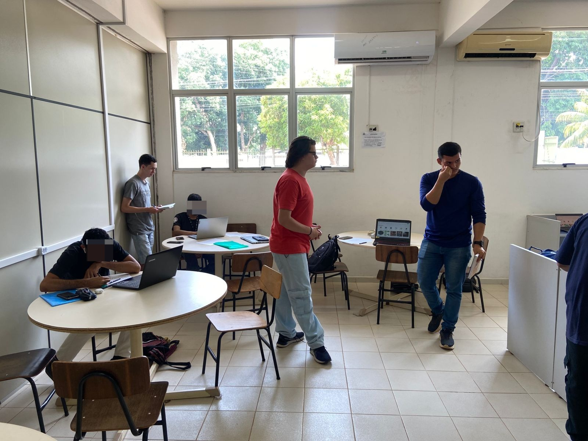
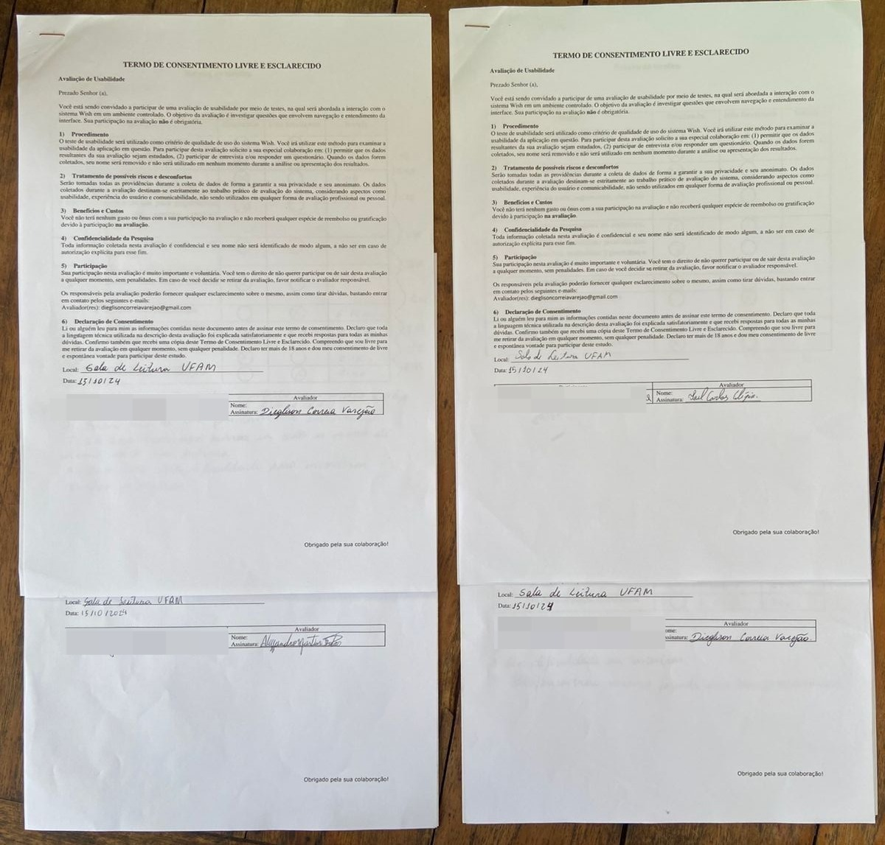
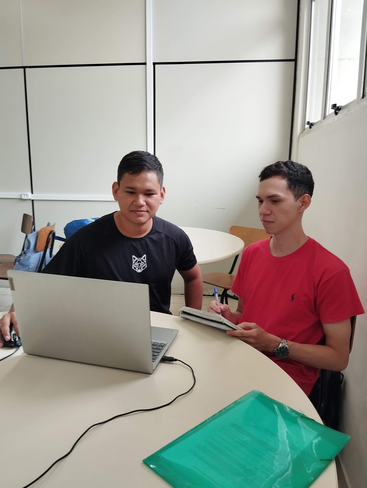
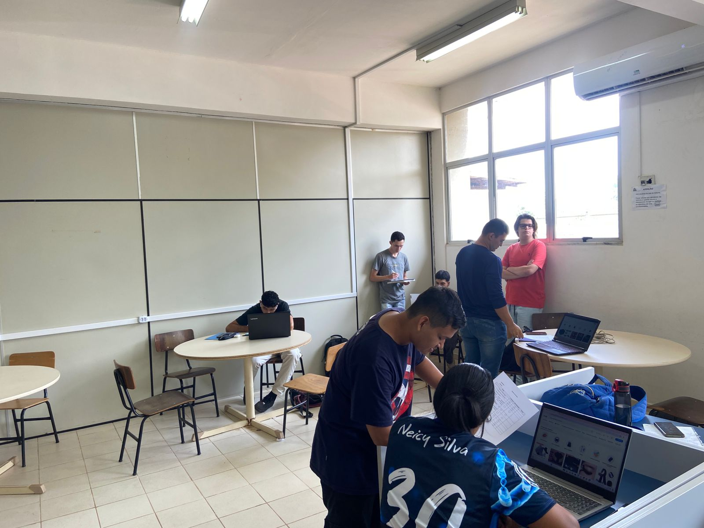

## - [Home](/README.md)
# 4 – Teste de Usabilidade

### 4.1 – Planejamento

O teste de usabilidade é uma avaliação aplicada com usuários representativos, no qual irão testar o sistema que está servindo como um objeto de avaliação. Este teste está estruturado em planejamento de teste, roteiro, preparação para o teste, teste piloto, execução do teste e análise dos resultados. O principal objetivo é captar informações de usabilidade do sistema Wish, a partir de teste e questionário com usuários comuns (que não tem conhecimentos avançados da área de tecnologia), a fim de mensurar a eficácia do sistema. Perfis dos 4 usuários: 

### Perfis dos Usuários:

- Usuários: Consumidores de produtos e-commerce.
- Número de participantes: 4 usuários.
- Faixa etária: entre 21 e 25 anos.
- Profissão: Sem restrição.
- Escolaridade: alfabetizados.
- Classe econômica: Sem restrição.
- Requisitos: Já ter utilizado um computador.

As métricas utilizadas durante esse processo foram taxa de sucesso, tempo, taxa de erros cometidos, satisfação do usuário. Além disso, usamos como técnica a observação, anotações de tarefas compridas e cronometragem (Figura 1).

<figure align="center">
  <figcaption>Figura 1. Teste de usabilidade</figcaption>
  
  <figcaption><i>Fonte: Autoria própria</i></figcaption>
</figure>

---

### 4.2 - Preparação para o teste

O ambiente escolhido para aplicação do teste foi a sala de estudo da UFAM- ICET, por ser uma ambiente tranquilo e silencioso, ideal para a realização do teste. Para adaptar o cenário foi utilizado como equipamento setup para desktop, conexão com uma rede de internet, papel, caneta, cronômetro e smartphone (de preferência do usuário). O recrutamento dos usuários foi feito pessoalmente, na qual foram escolhidos 4 voluntários que aceitaram participar do nosso teste. Foi explicado para os voluntários o objetivo do teste para a ciência dos participantes e também foi apresentado TCLE (Termo de Consentimento Livre e Esclarecido), a qual todos fizeram uma leitura minuciosa e consentiram com os termos estabelecidos.

<figure align="center">
  <figcaption>Figura 1. TCL de usabilidade</figcaption>
  
  <figcaption><i>Fonte: Autoria própria</i></figcaption>
</figure>
---

### 4.3 - Teste piloto

Ao simular o teste piloto, verificamos o setup desktop para ver se estava em pleno funcionamento. No entanto, alguns problemas foram observados, como uma falha na conexão local (UFAM), que afetou a estabilidade da rede, mas foi resolvida através do roteamento de internet móvel. Verificamos também que a estrutura da mesa de suporte tinha uma instabilidade, o que poderia comprometer o manuseio do equipamento e, como solução, procuramos outro balcão. Por fim, verificamos a página para ver se estava funcionando como esperado, para podermos passar para a próxima etapa.

<figure align="center">
  <figcaption>Figura 1. Teste piloto</figcaption>
  
  <figcaption><i>Fonte: Autoria própria</i></figcaption>
</figure>

---

### 4.4 - Execução do teste

Como já descrito na etapa anterior, o teste foi aplicado na sala de leitura com quatro participantes, divididos em dois grupos de dois. Antes do início da avaliação foi explicado aos participantes algumas regras de como eles deveriam seguir para o pleno funcionamento do teste e foi entregue uma caneta e papel com as tarefas que eles deveriam realizar. Ao longo do teste, monitoramos os usuários e avaliamos quais tarefas eles tinham facilidade ou dificuldade de execução.

<figure align="center">
  <figcaption>Figura 1. Execução do teste </figcaption>
  
  <figcaption><i>Fonte: Autoria própria</i></figcaption>
</figure>

---

### 4.5 - Análise dos resultados

##### Verdadeiro = *V*  | Falso = *F* | Minutos = *mim*

#### Tarefa 1

| Participante | Finalizou | Não finalizou | Tempo gasto |
|--------------|-----------|---------------|-------------|
| P1   | V         | F             | 08:05 mim   |
| P2| F         | V             | 06:10 mim   |
| P3     | F         | V             | 08:25 mim   |
| P4    | V         | F             | 05:25 mim   |

#### Tarefa 2

| Participante | Finalizou | Não finalizou | Tempo gasto |
|--------------|-----------|---------------|-------------|
| P1   | V         | F             | 02:05 mim   |
| P2| V         | F             | 00:40 mim   |
| P3     | V         | F             | 01:05 mim   |
| P4    | V         | F             | 00:10 mim   |

#### Tarefa 3

| Participante | Finalizou | Não finalizou | Tempo gasto |
|--------------|-----------|---------------|-------------|
| P1   | V         | F             | 01:35 mim   |
| P2| V         | F             | 00:15 mim   |
| P3     | V         | F             | 04:45 mim   |
| P4    | V         | F             | 00:15 mim   |

#### Tarefa 4

| Participante | Finalizou | Não finalizou | Tempo gasto |
|--------------|-----------|---------------|-------------|
| P1   | V         | F             | 03:40 mim   |
| P2| V         | F             | 04:25 mim   |
| P3     | V         | F             | 00:55 mim   |
| P4    | V         | F             | 02:40 mim   |

#### Tarefa 5

| Participante | Finalizou | Não finalizou | Tempo gasto |
|--------------|-----------|---------------|-------------|
| P1   | V         | F             | 01:50 mim   |
| P2| V         | F             | 01:20 mim   |
| P3     | V         | F             | 02:15 mim   |
| P4    | V         | F             | 02:20 mim   |

#### Tarefa 6

| Participante | Finalizou | Não finalizou | Tempo gasto |
|--------------|-----------|---------------|-------------|
| P1   | V         | F             | 02:25 mim   |
| P2| V         | F             | 01:25 mim   |
| P3     | V         | F             | 00:55 mim   |
| P4    | V         | F             | 00:50 mim   |

#### Tarefa 7

| Participante | Finalizou | Não finalizou | Tempo gasto |
|--------------|-----------|---------------|-------------|
| P1   | V         | F             | 00:20 mim   |
| P2| F         | V             | 06:00 mim   |
| P3     | V         | F             | 00:55 mim   |
| P4    | F         | V             | 01:25 mim   |

#### Tarefa 8

| Participante | Finalizou | Não finalizou | Tempo gasto |
|--------------|-----------|---------------|-------------|
| P1   | V         | F             | 00:55 mim   |
| P2| V         | F             | 00:20 mim   |
| P3     | F         | V             | 01:11 mim   |
| P4    | V         | F             | 00:15 mim   |

#### Tarefa 9

| Participante | Finalizou | Não finalizou | Tempo gasto |
|--------------|-----------|---------------|-------------|
| P1   | V         | F             | 01:35 mim   |
| P2| V         | F             | 02:10 mim   |
| P3     | V         | F             | 00:05 mim   |
| P4    | V         | F             | 00:25 mim   |

#### Tarefa 10

| Participante | Finalizou | Não finalizou | Tempo gasto |
|--------------|-----------|---------------|-------------|
| P1   | F         | V             | 06:45 mim   |
| P2| F         | V             | 02:40 mim   |
| P3     | V         | F             | 01:11 mim   |
| P4    | F         | V             | 01:00 mim   |

### 4.5.1 - Coleção

#### Problema indentificado no Texte de usabilidade

| Tarefa | Problema | Participante(s) Afetado(s) |
|--------|----------|----------------------------|
| 1. Realizar cadastro/login | Demora para chegar código de confirmação | P1, P2-joão, P3, P4 |
| 1. Realizar cadastro/login | Confusão entre formulários de login e cadastro | P1 |
| 1. Realizar cadastro/login | Dificuldade em saber qual área preencher | P2-joão |
| 3. Realizar pedido | Ícone de compra não intuitivo | P1 |
| 3. Realizar pedido | Falta de autopreenchimento no formulário de endereço | P1 |
| 4. Finalizar compra | Falta de prevenção de erro e intuitividade na inserção de CPF para pagamento PIX | P1 |
| 4. Finalizar compra | Falta de preenchimento automático na área de CEP | P2-joão, P4 |
| 4. Finalizar compra | Demora no código de confirmação do PIX | P2-joão, P4 |
| 5. Editar informações de endereço | Localização do botão editar endereço de difícil acesso | P2-joão |
| 5. Editar informações de endereço | Dificuldade em encontrar, pouco intuitivo | P4 |
| 6. Adicionar/remover produtos dos favoritos | Botão de excluir pouco intuitivo | P2-joão |
| 7. Acessar área de vendedor | Não conseguiu encontrar | P2-joão, P4 |
| 8. Acessar área de política e privacidade | Não encontrou busca em menus e barra de pesquisa sem retorno | P2-joão |
| 8. Acessar área de política e privacidade | Não conseguiu encontrar a página | P3 |
| 9. Acessar área de ajuda | Dificuldade de encontrar, não intuitivo | P2-joão |
| 10. Acessar área de denúncia | Confusão com área de reportar | P1 |
| 10. Acessar área de denúncia | Não encontrou/não conseguiu acessar | P1, P2-joão, P4 |

---

### 4.5.2 - Discriminação.

### Participante 1

| ID Questão | Descrição do Problema | Fator de Usabilidade |
|------------|------------------------|----------------------|
| 1 | Confusão entre formulários de login e cadastro | Consistência e padrões |
| 1 | Atraso no envio do código de confirmação | Visibilidade do status do sistema |
| 3 | Ícone de compra não intuitivo | Correspondência entre o sistema e o mundo real |
| 3 | Falta de autopreenchimento no formulário de endereço | Prevenção de erros |
| 4 | Falta de prevenção de erro e intuitividade na inserção de CPF para pagamento PIX | Prevenção de erros, Visibilidade do status do sistema |
| 10 | Confusão com área de reportar, dificuldade em encontrar área de denúncia | Consistência e padrões, Reconhecimento em vez de lembrança |

### Participante 2

| ID Questão | Descrição do Problema | Fator de Usabilidade |
|------------|------------------------|----------------------|
| 1 | Dificuldade em saber qual área preencher para realizar cadastro | Correspondência entre o sistema e o mundo real |
| 1 | Demora no envio do código de confirmação | Visibilidade do status do sistema |
| 4 | Falta de preenchimento automático na área de CEP | Prevenção de erros |
| 4 | Demora no código de confirmação do PIX | Visibilidade do status do sistema |
| 5 | Localização do botão editar endereço de difícil acesso | Flexibilidade e eficiência de uso |
| 6 | Botão de excluir pouco intuitivo | Reconhecimento em vez de lembrança |
| 7 | Não conseguiu encontrar área de vendedor | Reconhecimento em vez de lembrança |
| 8 | Não encontrou busca em menus e barra de pesquisa sem retorno | Controle e liberdade do usuário |
| 9 | Dificuldade de encontrar área de ajuda, não intuitivo | Reconhecimento em vez de lembrança |
| 10 | Não encontrou área de denúncia e desistiu | Reconhecimento em vez de lembrança |

## - [Home](/README.md)